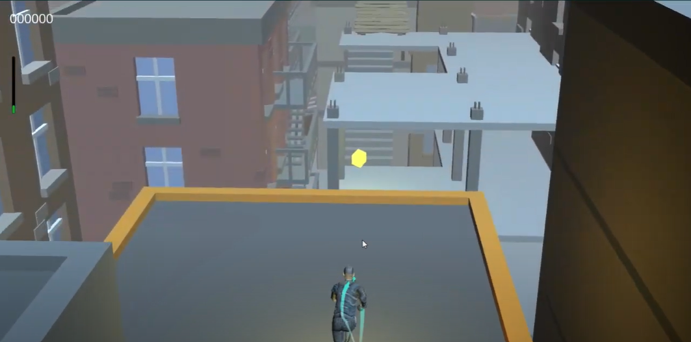

# Skyline Sprinter
This project contains several learning projects, but the final project for the class was Skyline Sprinter. This game takes inspiration from temple run and games like it. The primary features of this game are an infinite world generation system and a character controller.
[YouTube Video](https://youtu.be/WMQbOF3VzS0)

